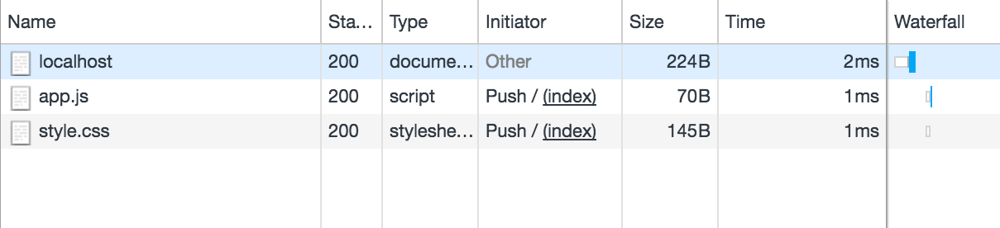

+++
date = "2011-03-24T21:12:42+09:00"
title = "HTTP/2 サーバプッシュ（HTTP/2 Server Push）"
draft = false
tags = ["http", "technical"]
+++

# HTTP/2 サーバプッシュ
["HTTP/2 Server Push"](https://blog.golang.org/h2push) by Jaana Burcu Dogan, Tom Bergan

## はじめに

HTTP/2 は HTTP/1.x における多くの欠点に取り組むために設計されています。現代の Web ページは多くのリソースを使用します: HTML、スタイルシート、スクリプト、画像、など。HTTP/1.x では、そのリソースそれぞれが明示的にリクエストされなければなりませんでした。これでは処理が遅くなります。ブラウザが HTML を取得し始めると、ページをパースして評価するときに初めて追加のリソースが必要であると認識します。サーバはブラウザがそれぞれのリクエストを生成するのを待たないといけないので、ネットワークは頻繁にアイドル状態となり活動を休止します。

遅延を改善するために HTTP/2 は、ブラウザが明示的にリソースをリクエストする前にサーバがブラウザに対しリソースをプッシュできる*サーバプッシュ*を導入しました、サーバはページが沢山の追加リソースを頻繁に必要とすることを分かっているため、最初の要求に対するレスポンスとしてそれらのリソースをプッシュし始めることができます。これでサーバがアイドル状態のネットワークを十分に活用でき、ページのロード時間を改善できます。


プロトコルのレベルでは、HTTP/2 サーバプッシュは `PUSH_PROMISE` フレームドリブンです。`PUSH_PROMISE` は、サーバがブラウザが近い将来リクエストすると予測する、リクエストを表します。ブラウザが `PUSH_PROMISE` を受け取るとすぐに、サーバがそのリソースを届けるつもりであるとブラウザは理解します。ブラウザがこのリソースが必要であると遅れて気づいた場合は、ブラウザは新しいリクエストを送らずにプッシュが完了するのを待つでしょう。

## net/http におけるサーバプッシュ

Go1.8は [`http.Server`](https://golang.org/pkg/net/http/#Server) からのレスポンスをプッシュするためのサポートを導入しました。この特徴は動作中のサーバが HTTP/2 サーバであり HTTP/2 を使用するコネクションが来た場合に利用されます。任意の HTTP ハンドラの中で、http.ResponseWriter が新しい [`http.Pusher`](https://golang.org/pkg/net/http/#Pusher) インターフェースを実装しているか確認することでサーバプッシュをサポートしているかどうか、あなたは強く主張することができます。

例えば、ページを描画するのに `app.js` が要求されるだろうとサーバが分かっている場合、ハンドラは `http.Pusher` が利用可能であればプッシュを開始することができます:

```
http.HandleFunc("/", func(w http.ResponseWriter, r *http.Request) {
    if pusher, ok := w.(http.Pusher); ok {
        // Push is supported.
        if err := pusher.Push("/app.js", nil); err != nil {
            log.Printf("Failed to push: %v", err)
        }
    }
    // ...
})
```

Push 呼び出しは `/app.js` のための統合リクエストを作成し、`PUSH_PROMISE` フレームの中にそのリクエストを統合し、プッシュされるレスポンスを生成するサーバのリクエストハンドラに統合リクエストを転送します。Push の2つ目の引数は `PUSH_PROMISE` に含める追加のヘッダを明示します。例えば、`/app.js` へのレスポンスが Accept-Encoding によって異なる場合、`PUSH_PROMISE` は Accept-Encoding 値を含むべきです:

```
http.HandleFunc("/", func(w http.ResponseWriter, r *http.Request) {
    if pusher, ok := w.(http.Pusher); ok {
        // Push is supported.
        options := &http.PushOptions{
            Header: http.Header{
                "Accept-Encoding": r.Header["Accept-Encoding"],
            },
        }
        if err := pusher.Push("/app.js", options); err != nil {
            log.Printf("Failed to push: %v", err)
        }
    }
    // ...
})
```

完全な動作例は以下のコマンドで利用できます:

```
$ go get golang.org/x/blog/content/h2push/server
```

サーバを動作させ [https://localhost:8080](https://localhost:8080) をロードすると、ブラウザの開発者ツールには `app.js` と `style.css` がサーバからプッシュされたと表示されるはずです。



## レスポンスの前にプッシュし始める

レスポンスの任意のバイトを送る前に Push メソッドの呼び出しを行うことは良いアイデアです。そうしないと、誤ってレスポンスの複製を作成してしまう場合があります。例えば、あなたはHTML レスポンスの一部を書いていたとします:

```
<html>
<head>
    <link rel="stylesheet" href="a.css">...
```

そのとき、あなたは Push("a.css", nil) を呼びます。ブラウザは PUSH_PROMISE を受け取る前にこの HTML 片をパースするかもしれません、その場合ブラウザは `PUSH_PROMISE` を受け取るほか、`a.css` 用のリクエストを送るでしょう。今回サーバは `a.css` 用のレスポンスを2つ生成するでしょう。レスポンスを記述する前に Push を呼ぶことはこの可能性全体を無効にします。

## サーバプッシュの使い時

あなたのネットワークリンクがアイドル状態のときにサーバプッシュを使うことを考えてみましょう。あなたの Web アプリのために HTML を送り終えたばかりですよね？待ちによって時間を浪費しないで、あなたのクライアントが必要とするリソースをプッシュし始めましょう。あなたは遅延を減らすために HTML ファイルの中にリソースをインラインしているでしょうか？インラインの代わりに、プッシュしてみましょう。クライアントがリダイレクトを追う間は常に無駄な往復が発生するので、リダイレクトはプッシュを使用するもう一つの良い機会です。プッシュを使用する多くのシナリオが考えられます -- 私たちは取り組み始めたばかりです。

私たちはちょっとした注意について言及しなければ、またミスをおかすところでした。まず初めに、あなたは信頼できるサーバにだけリソースをプッシュすることができます -- これはサードパーティのサーバや CDN 上にホストされたリソースをプッシュできないことを意味します。2つ目に、リソースがクライアントによって実際に必要とされると確信するまでリソースをプッシュしてはいけません、そうしないとあなたのプッシュは帯域幅を浪費します。そこから導かれる結論は、クライアントがすでにそれらのリソースをキャッシュしているようなときはリソースのプッシュを避けることです。3つ目に、あなたのページ上にある全てのリソースをプッシュするナイーブなアプローチはパフォーマンスをより悪くします。嘘だと思うなら、測ってみてください。

以下のリンクは良い補足資料です:

* [HTTP/2 Push: The Details](https://calendar.perfplanet.com/2016/http2-push-the-details/)
* [Innovating with HTTP/2 Server Push](https://www.igvita.com/2013/06/12/innovating-with-http-2.0-server-push/)
* [Cache-Aware Server Push in H2O](https://github.com/h2o/h2o/issues/421)
* [The PRPL Pattern](https://developers.google.com/web/fundamentals/performance/prpl-pattern/)
* [Rules of Thumb for HTTP/2 Push](https://docs.google.com/document/d/1K0NykTXBbbbTlv60t5MyJvXjqKGsCVNYHyLEXIxYMv0)
* [Server Push in the HTTP/2 spec](https://tools.ietf.org/html/rfc7540#section-8.2)

## 結論

Go1.8では、標準ライブラリは HTTP/2 のための独創的なサポートを提供しており、あなたの Web アプリケーションを最適化できるようさらなる柔軟性を与えます。

[HTTP/2 サーバプッシュデモ](https://http2.golang.org/serverpush) ページではそれが実際に動作する様子を見ることができます。

## あわせて読みたい
* [HTTP/2 Push: The Details](https://calendar.perfplanet.com/2016/http2-push-the-details/)
* [Innovating with HTTP/2 Server Push](https://www.igvita.com/2013/06/12/innovating-with-http-2.0-server-push/)
* [Cache-Aware Server Push in H2O](https://github.com/h2o/h2o/issues/421)
* [The PRPL Pattern](https://developers.google.com/web/fundamentals/performance/prpl-pattern/)
* [Rules of Thumb for HTTP/2 Push](https://docs.google.com/document/d/1K0NykTXBbbbTlv60t5MyJvXjqKGsCVNYHyLEXIxYMv0)
* [Server Push in the HTTP/2 spec](https://tools.ietf.org/html/rfc7540#section-8.2)
* [Introducing HTTP Tracing](https://blog.golang.org/http-tracing)
* [Generating code](https://blog.golang.org/generate)
* [Introducing the Go Race Detector](https://blog.golang.org/race-detector)
* [Go maps in action](https://blog.golang.org/go-maps-in-action)
* [go fmt your code](https://blog.golang.org/go-fmt-your-code)
* [Organizing Go code](https://blog.golang.org/organizing-go-code)
* [Debugging Go programs with the GNU Debugger](https://blog.golang.org/debugging-go-programs-with-gnu-debugger)
* [The Go image/draw package](https://blog.golang.org/go-imagedraw-package)
* [The Go image package](https://blog.golang.org/go-image-package)
* [The Laws of Reflection](https://blog.golang.org/laws-of-reflection)
* [Error handling and Go](https://blog.golang.org/error-handling-and-go)
* ["First Class Functions in Go"](https://blog.golang.org/first-class-functions-in-go-and-new-go)
* [Profiling Go Programs](https://blog.golang.org/profiling-go-programs)
* [A GIF decoder: an exercise in Go interfaces](https://blog.golang.org/gif-decoder-exercise-in-go-interfaces)
* [Introducing Gofix](https://blog.golang.org/introducing-gofix)
* [Godoc: documenting Go code](https://blog.golang.org/godoc-documenting-go-code)
* [Gobs of data](https://blog.golang.org/gobs-of-data)
* [C? Go? Cgo!](https://blog.golang.org/c-go-cgo)
* [JSON and Go](https://blog.golang.org/json-and-go)
* [Go Slices: usage and internals](https://blog.golang.org/go-slices-usage-and-internals)
* [Go Concurrency Patterns: Timing out, moving on](https://blog.golang.org/go-concurrency-patterns-timing-out-and)
* [Defer, Panic, and Recover](https://blog.golang.org/defer-panic-and-recover)
* [Share Memory By Communicating](https://blog.golang.org/share-memory-by-communicating)
* [JSON-RPC: a tale of interfaces](https://blog.golang.org/json-rpc-tale-of-interfaces)
